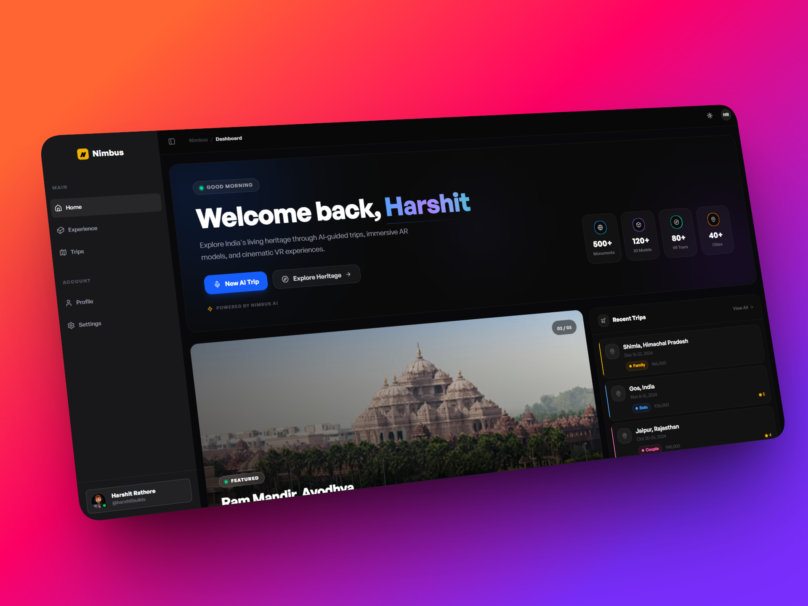
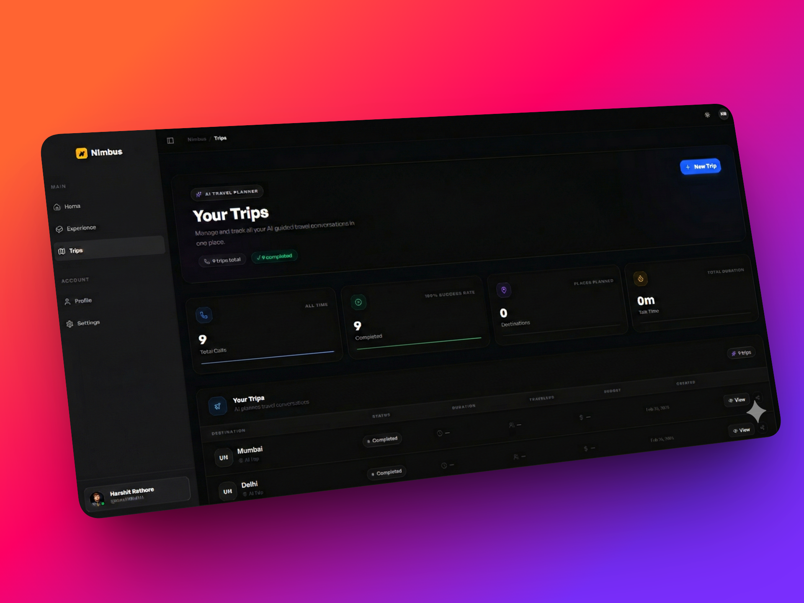
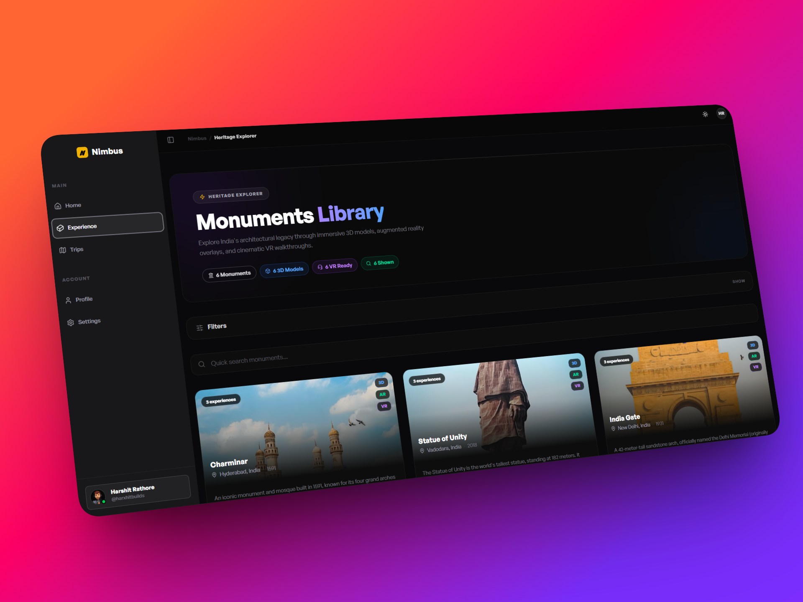
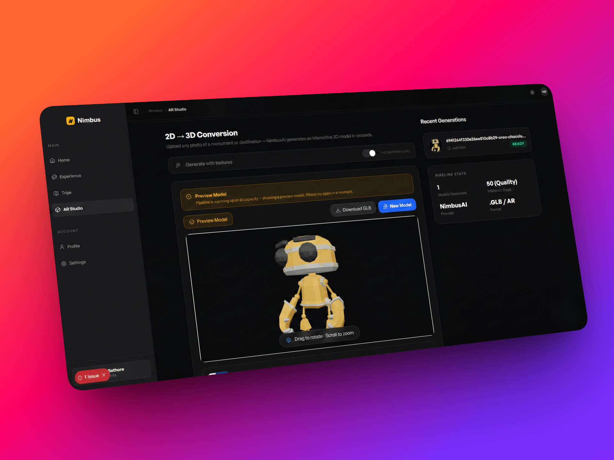
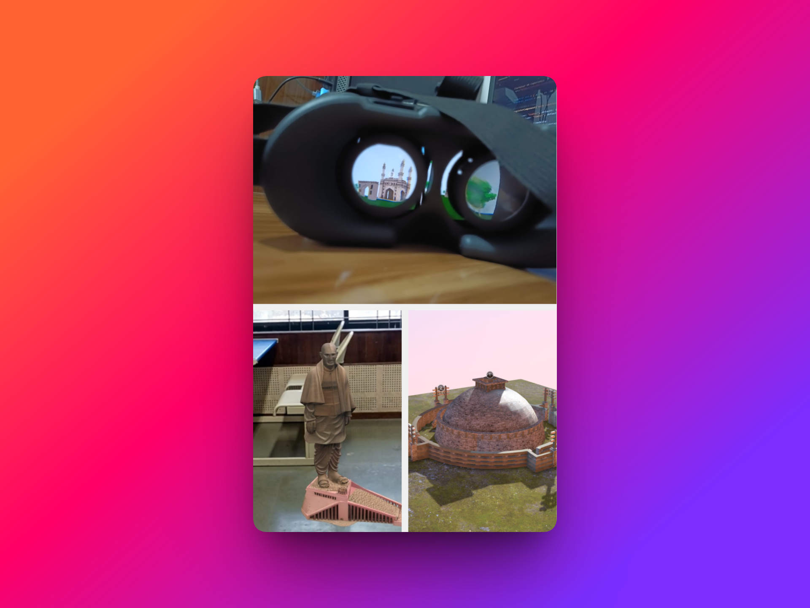
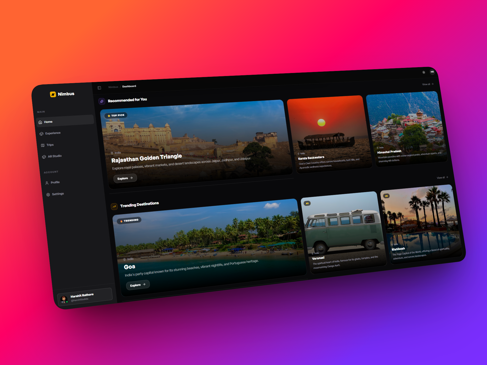
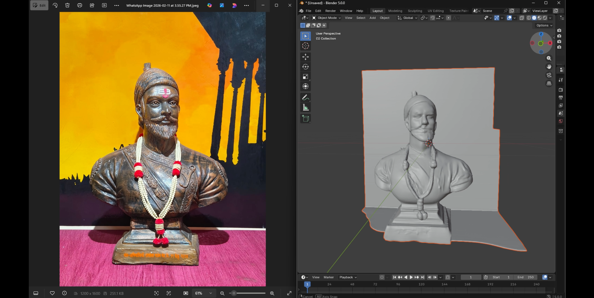
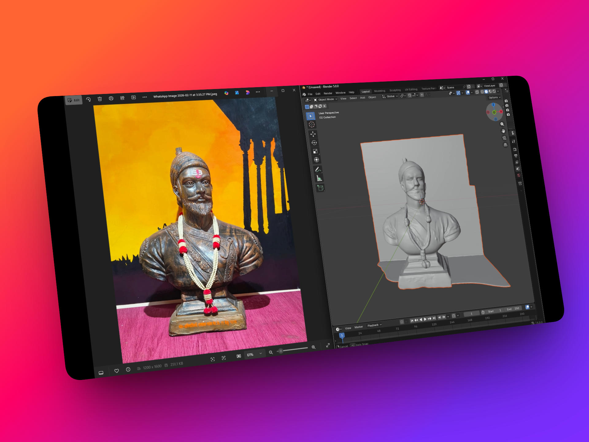

<p align="center">
  
</p>

<h1 align="center">🏛️ Nimbus</h1>

<p align="center">
  <strong>AI-Powered Heritage Travel Platform for India</strong><br/>
  Voice-guided trips · AR/VR/3D experiences · 2D→3D generation · Group planning · Smart recommendations
</p>

<p align="center">
  
  
  
  
  
  
  
  
</p>

<p align="center">
  <a href="https://voyage-hack-3-0-pixel.vercel.app"><strong>🌐 Live Demo</strong></a> &nbsp;·&nbsp;
  <a href="https://voyage-hack-3-0-pixel.onrender.com/status"><strong>⚡ API Status</strong></a>
</p>

---

## What is Nimbus?

Nimbus bridges traditional Indian heritage tourism with next-generation AI technology. In one platform, users can:

- 📞 **Plan & book a full trip by voice** — AI agent calls your phone, converses in any language, books flights + hotels live on the call, and emails a PDF itinerary before you hang up.
- 🎨 **Convert any photo into a 3D model** using a custom transformer pipeline trained from scratch (NimbusAI).
- 🏛️ **Explore 500+ monuments** in interactive 3D, augmented reality, and full VR walkthroughs.
- 💬 **Plan trips with friends** via AI-powered group chat rooms with consensus voting.
- 🤖 **Get personalised destination picks** powered by Gemini based on your travel preferences.

---

## 🎬 Demo Video

<p align="center">
  <video src="https://wormhole.app/bLrqpP#vDfuYGKUfZLVDc7XdcanxQ" controls width="100%" style="border-radius:12px;max-width:860px">
    Your browser does not support the video tag.
    <a href="./promotional_video.mp4">▶ Watch the Nimbus demo video</a>
  </video>
</p>

---

## 🖥️ Screenshots

| Dashboard                                             | Trips                                         |
| ----------------------------------------------------- | --------------------------------------------- |
|  |  |

| Heritage Explorer                                   | AR Studio (2D→3D)                                     |
| --------------------------------------------------- | ----------------------------------------------------- |
|  |  |

| AR / VR Experience                                 | AI Recommendations                                      |
| -------------------------------------------------- | ------------------------------------------------------- |
|  |  |

| 2D → 3D Generation                               | Email Itinerary                                |
| ------------------------------------------------ | ---------------------------------------------- |
|  |  |

---

## 🚀 Core Features

### 1 · 📞 Voice Agent & End-to-End Trip Booking

> _Vapi AI · Twilio · Gemini 2.5 Flash · MCP Server · SSE · Gmail API · Amadeus · RapidAPI_

The flagship feature. One click → outbound phone call to the user's number. The AI agent doesn't just plan — it **books everything and emails a confirmed itinerary, all on the call**:

```
Click "New Trip"
   → Vapi outbound call to user's phone
   → Natural voice conversation (any language)
   → MCP tools fire in real time mid-call:
        ┌─ search_flights()     Amadeus API — live fares + seat availability
        ├─ book_flight()        Confirms ticket, returns PNR
        ├─ search_hotels()      RapidAPI Hotels — live inventory by city/date
        ├─ book_hotel()         Confirms room, returns booking ID
        └─ send_itinerary()     Gmail API — full PDF itinerary to user's email
   → Call ends → transcript sent to Gemini 2.5 Flash
   → Structured day-by-day itinerary saved to MongoDB
   → Rich trip detail page live on dashboard instantly
```

**MCP (Model Context Protocol) server** exposes a live tool registry to the Vapi assistant so the AI can call real APIs mid-sentence without dropping the conversation. The user hears _"I've found a ₹4,200 IndiGo flight on the 15th — shall I book it?"_ and a confirmation email lands in their inbox before the call ends.

Call status (`queued → ringing → in-progress → ended`) is streamed to the UI in real time via **Server-Sent Events (SSE)**. Once the call ends, Gemini extracts costs, activities, tips, and monument recommendations into a full structured itinerary.

| MCP Tool         | Provider              | What it does                                  |
| ---------------- | --------------------- | --------------------------------------------- |
| `search_flights` | Amadeus API           | Live fares, stops, duration                   |
| `book_flight`    | Amadeus API           | Confirms booking, returns PNR                 |
| `search_hotels`  | RapidAPI Hotels       | Real-time room availability + pricing         |
| `book_hotel`     | RapidAPI Hotels       | Confirms room, returns booking ref            |
| `get_monuments`  | MongoDB (internal)    | AR-enabled heritage sites near destination    |
| `send_itinerary` | Gmail API (OAuth 2.0) | Sends formatted PDF itinerary to user's inbox |

---

### 2 · 🎨 2D → 3D AI Generation (NimbusAI)

> _Custom transformer model · Hugging Face Spaces · `@gradio/client` · `<model-viewer>`_

**NimbusAI** is a proprietary image-to-3D pipeline trained from scratch on monument and object photographs paired with photogrammetry ground-truth meshes:

```
Photo upload → Background Segmentation → Geometry Mesh → PBR Texture Baking → .glb output
```

Upload any JPEG/PNG (≤ 20 MB) in the AR Studio. A live 5-step progress indicator walks through the pipeline. The output is a fully textured `.glb` file rendered with Google's `<model-viewer>` — downloadable and usable directly in Blender, Unity, or Unreal Engine. A warm-up fallback returns a showcase model so the feature always demos cleanly.

---

### 3 · 🥽 AR / VR / 3D Heritage Experiences

> _Sketchfab Viewer API · A-Frame · WebXR · AR.js_

Every monument in the library supports three immersive viewing modes:

| Mode   | Tech                          | Experience                                                  |
| ------ | ----------------------------- | ----------------------------------------------------------- |
| **3D** | Sketchfab Viewer API          | Orbitable, fully-lit 3D model embedded in-browser           |
| **AR** | A-Frame + AR.js (WebAR)       | Overlay the monument on the real world via phone camera     |
| **VR** | A-Frame (self-contained HTML) | Fullscreen 360° walkthrough with audio narration & hotspots |

Every interaction is tracked via `trackVisit` → powers the user's **Heritage Score** visible on their profile.

---

### 4 · 💬 Group Trip Planning with AI Consensus

> _Socket.IO · Gemini AI · Real-time messaging_

Friends planning a trip together can join a shared **Group Chat Room** (invite code system). Once everyone has discussed preferences, one click fires an AI plan generation call to Gemini — which returns a structured trip proposal with title, summary, and action items. All members see a **consensus card** and can vote to approve the plan. Vote progress is visible live via Socket.IO.

---

### 5 · 🤖 AI-Powered Recommendations

> _Gemini 2.0 Flash · Unsplash API · Zustand_

Users complete a one-time preference profile (travel style, budget, group size, hometown). This is sent as structured context to **Gemini 2.0 Flash**, which returns a ranked list of Indian destinations with **semantic match scores** (0–1), rich descriptions, and live Unsplash photography. A separate Gemini call powers **Trending Destinations** — scored by seasonal relevance and cultural significance. A curated static fallback (5 iconic Indian monuments) ensures the page is never empty.

---

## 💼 Business Model & Revenue Streams

> India's heritage tourism sector is a **₹2.3 lakh crore (~$28B) opportunity** — yet less than 4% of ASI monuments have any digital presence. Nimbus is positioned to own that gap.

<table>
<tr>
<td width="50%" valign="top">

### 🔌 1 · NimbusAI API-as-a-Service

**Sell our trained 2D→3D model as a cloud API.**

Museums, e-commerce platforms, interior design apps, and ed-tech companies all need 3D views from a single product photo — without building the ML pipeline themselves.

- **Tier 1 — Free:** 10 generations/month (developer onboarding)
- **Tier 2 — Studio ₹4,999/mo:** 500 generations + priority queue
- **Tier 3 — Enterprise:** Unlimited + white-label + SLA

> 🎯 500 API customers in Year 1 → **₹2.5 Cr ARR**

</td>
<td width="50%" valign="top">

### 🇮🇳 2 · Govt & Incredible India Partnerships

**B2G revenue via ASI, Ministry of Tourism & state tourism boards.**

The Govt's _Dekho Apna Desh_ and _Incredible India 2.0_ initiatives have active digital mandates with allocated budgets. Nimbus provides a white-label, plug-and-play AR/VR/3D layer for any heritage site — no in-house tech team needed.

- **Integration fee** per monument digitised
- **Annual licence** for the AI voice-guide assistant
- **Co-branding** on national tourism campaigns

> 🎯 Pilot with 3 state tourism boards → **₹1.8 Cr contract pipeline**

</td>
</tr>
<tr>
<td width="50%" valign="top">

### 🏨 3 · B2B SaaS for Travel & Hospitality

**Subscription platform for tour operators, OTAs & hotels.**

Operators (MakeMyTrip, SOTC, Thomas Cook India) pay a monthly licence to embed Nimbus's AI trip-planning voice agent and AR monument experiences into their own apps.

- **Per-seat SaaS licence** for travel agents
- **Revenue share** on bookings generated by AI recommendations
- **Custom AI assistant** fine-tuned on operator's inventory

> 🎯 5 OTA integrations in Year 1 → **₹3.2 Cr ARR**

</td>
<td width="50%" valign="top">

### 🎓 4 · EdTech & Institutional Licensing

**License the 3D monument library + AR experiences to schools, universities & cultural institutions.**

India has 1.5M+ schools. History teachers have zero immersive tools. Nimbus packages curated AR/VR experiences as curriculum-aligned modules sold to CBSE/ICSE schools and ed-tech platforms (BYJU'S, Unacademy, Diksha).

- **Annual school licence ₹12,000/year** per institution
- **Platform deal** with national ed-tech players
- **Content creation fee** for new monument modules

> 🎯 1,000 schools in Year 1 → **₹1.2 Cr ARR**

</td>
</tr>
</table>

<p align="center">
  <strong>Combined Year-1 Revenue Target: ₹8.7 Cr ARR</strong> &nbsp;|&nbsp;
  TAM: ₹2.3 lakh crore &nbsp;|&nbsp;
  3,691 ASI-protected monuments undigitised &nbsp;|&nbsp;
  10.9 Cr domestic heritage tourists annually
</p>

---

## 🏗️ Architecture

```
Client (Next.js 16.1 + React 19 + Zustand)
        │  Axios (REST) + SSE + Socket.IO
        ▼
Server (Express 4 + Node.js)
  ├── /api/auth             Firebase Admin SDK → JWT cookies
  │       ├── signup · logout · check-auth
  │       ├── onboard · profile (GET/PUT)
  ├── /api/vapi             Vapi SDK · Gemini 2.5 Flash · SSE polling
  │       ├── call (outbound) · trips · insights · transcript
  │       ├── status/:callId/stream (SSE)   live call updates
  │       └── MCP Server ──► search_flights()    Amadeus API
  │                        ► book_flight()        Amadeus API
  │                        ► search_hotels()      RapidAPI Hotels
  │                        ► book_hotel()         RapidAPI Hotels
  │                        ► get_monuments()      MongoDB (internal)
  │                        ► send_itinerary()     Gmail API (OAuth 2.0)
  ├── /api/recommendations  Gemini 2.0 Flash · Unsplash API
  ├── /api/3dmodel          MongoDB monument library · trackVisit → Heritage Score
  ├── /api/model3d          NimbusAI · Hugging Face Spaces → .glb
  ├── /api/chatroom         Socket.IO · Gemini AI group planning
  ├── /health               JSON health check
  ├── /status               Live HTML API status dashboard
  └── /api/status           JSON status endpoint
        │
        ▼
MongoDB Atlas · Vapi AI · Twilio · Gemini · Amadeus · RapidAPI · Gmail · Hugging Face
```

---

## 🛠️ Tech Stack

**Frontend:** Next.js 16.1.6 · React 19 · TypeScript 5 · Tailwind CSS 4 · Shadcn/ui · Zustand 5 · Socket.IO Client · Firebase SDK 12 · GSAP · Leaflet / React-Leaflet · `<model-viewer>` · react-hook-form · sonner · motion

**Backend:** Express 4 · Node.js (ESM) · MongoDB / Mongoose 8 · Firebase Admin 13 · `@vapi-ai/server-sdk` · `@google/generative-ai` · `@google/genai` · `@gradio/client` · Socket.IO · multer · winston · morgan · jsonwebtoken · cookie-parser

**External APIs:** Vapi AI · Twilio · Gemini 2.5 Flash · Gemini 2.0 Flash · Unsplash · Sketchfab Viewer API · Hugging Face Spaces · Amadeus Flights API · RapidAPI Hotels · Gmail API (OAuth 2.0)

**Infrastructure:** Vercel (frontend) · Render (backend) · MongoDB Atlas

---

## 📦 Key Data Models

<details>
<summary><strong>User</strong></summary>

```js
{
  name, firstName, lastName, username,
  email, profile,            // avatar URL
  hometown,
  onBoarded: Boolean,
  travelPreferences: {
    travelStyle[], budgetRange[], groupSize[],
    tripDuration[], travelFrequency[],
    accommodationType[], transportationPreference[]
  },
  trips: [ref → Trip],
  visitedMonuments: [ref → ThreeDModel]
}
```

</details>

<details>
<summary><strong>Trip</strong></summary>

```js
{
  userId,                    // ref → User
  callId,                    // Vapi call ID (unique)
  phoneNumber,
  transcript: String,
  callStatus: "queued" | "ringing" | "in-progress" | "forwarding" | "ended",
  callDuration: Number,      // seconds
  tripDetails: {
    destination, startDate, endDate,
    budget, travelers: Number,
    preferences[], activities[]
  },
  aiInsights: { keyPoints[], tripSummary, processedAt },
  itinerary: [{ day, title, activities[], estimatedCost, tips }],
  assistantId, phoneNumberId
}
```

</details>

<details>
<summary><strong>Monument (ThreeDModel)</strong></summary>

```js
{
  name, description, location,
  yearBuilt: Number,
  architecture, significance,
  imageUrl,
  sketchfabUid,    // 3D viewer embed UID
  arlink,          // WebAR experience URL
  vrHTMLPath       // self-contained VR HTML file path
}
```

</details>

<details>
<summary><strong>ChatRoom</strong></summary>

```js
{
  name, description,
  inviteCode,                // unique join code
  isActive: Boolean,
  createdBy: ref → User,
  members: [{ userId, name, avatar, joinedAt }],
  messages: [{
    senderId, senderName, senderAvatar,
    content: String,
    type: "user" | "ai" | "system",
    plan: { title, summary, actionItems[] },  // only on type==="ai"
    votes: [{ userId, userName }]
  }]
}
```

</details>

---

## 📡 API Reference

### Auth (`/api/auth`)

| Method | Endpoint               | Auth | Description                               |
| ------ | ---------------------- | ---- | ----------------------------------------- |
| `POST` | `/api/auth/signup`     | —    | Register with Firebase token → JWT cookie |
| `POST` | `/api/auth/logout`     | —    | Clear session cookie                      |
| `GET`  | `/api/auth/check-auth` | ✅   | Verify JWT + return current user          |
| `POST` | `/api/auth/onboard`    | ✅   | Save travel preferences after first login |
| `GET`  | `/api/auth/profile`    | ✅   | Get full user profile                     |
| `PUT`  | `/api/auth/profile`    | ✅   | Update user profile                       |

### Voice & Trips (`/api/vapi`)

| Method | Endpoint                          | Auth | Description                                |
| ------ | --------------------------------- | ---- | ------------------------------------------ |
| `POST` | `/api/vapi/call`                  | ✅   | Start outbound AI voice trip-planning call |
| `GET`  | `/api/vapi/trips`                 | ✅   | List all trips for authenticated user      |
| `GET`  | `/api/vapi/trip/:tripId`          | ✅   | Get single trip detail                     |
| `GET`  | `/api/vapi/insights/:tripId`      | ✅   | Get AI-processed trip insights             |
| `GET`  | `/api/vapi/transcript/:callId`    | ✅   | Fetch raw call transcript                  |
| `GET`  | `/api/vapi/status/:callId/stream` | ✅   | **SSE** — live call status updates         |
| `POST` | `/api/vapi/webhook`               | —    | Vapi webhook receiver (no auth)            |

### Monuments & 3D Models (`/api/3dmodel`)

| Method | Endpoint             | Auth | Description                           |
| ------ | -------------------- | ---- | ------------------------------------- |
| `GET`  | `/api/3dmodel/`      | ✅   | Full monument library                 |
| `POST` | `/api/3dmodel/visit` | ✅   | Track monument visit → Heritage Score |

### AI 2D→3D Generation (`/api/model3d`)

| Method | Endpoint                | Auth | Description                           |
| ------ | ----------------------- | ---- | ------------------------------------- |
| `POST` | `/api/model3d/generate` | ✅   | Upload image → NimbusAI → `.glb` file |

`multipart/form-data` · max 20 MB · image files only  
Returns: `{ glbUrl, texturedGlbUrl, segmentedImageUrl, seed, isPreview }`

### Recommendations (`/api/recommendations`)

| Method | Endpoint                            | Auth | Description                                   |
| ------ | ----------------------------------- | ---- | --------------------------------------------- |
| `GET`  | `/api/recommendations/personalized` | ✅   | Gemini-powered personalised destination picks |
| `GET`  | `/api/recommendations/trending`     | ✅   | Gemini-powered trending destinations          |

### Group Chat (`/api/chatroom`)

| Method | Endpoint                                        | Auth | Description                     |
| ------ | ----------------------------------------------- | ---- | ------------------------------- |
| `POST` | `/api/chatroom/create`                          | ✅   | Create a group planning room    |
| `POST` | `/api/chatroom/join`                            | ✅   | Join room via invite code       |
| `GET`  | `/api/chatroom/my-rooms`                        | ✅   | List user's rooms               |
| `GET`  | `/api/chatroom/:roomId`                         | ✅   | Get room + message history      |
| `POST` | `/api/chatroom/:roomId/message`                 | ✅   | Send a message                  |
| `POST` | `/api/chatroom/:roomId/generate-plan`           | ✅   | Generate AI consensus trip plan |
| `POST` | `/api/chatroom/:roomId/message/:messageId/vote` | ✅   | Vote on an AI-generated plan    |

### System

| Method | Endpoint      | Auth | Description                        |
| ------ | ------------- | ---- | ---------------------------------- |
| `GET`  | `/health`     | —    | Basic health check (JSON)          |
| `GET`  | `/status`     | —    | **HTML** live API status dashboard |
| `GET`  | `/api/status` | —    | **JSON** status + system health    |

---

## ⚡ Getting Started

```bash
# 1. Clone
git clone https://github.com/your-org/nimbus.git
cd nimbus

# 2. Install dependencies
cd client && npm install
cd ../server && npm install

# 3. Configure environment variables
# Create server/.env and client/.env.local (see Environment Variables below)

# 4. Seed the monument library
cd server && npm run seed:3dmodels

# 5. Start both servers (in separate terminals)
# Terminal 1 — Backend:
cd server && npm run dev      # → http://localhost:8000

# Terminal 2 — Frontend:
cd client && npm run dev      # → http://localhost:3000
```

<details>
<summary><strong>Environment Variables</strong></summary>

**`server/.env`**

```env
# Core
MONGO_URL=
JWT_SECRET=
PORT=8000

# AI
GEMINI_API_KEY=

# Media
UNSPLASH_ACCESS_KEY=

# Voice Agent (Vapi + Twilio)
VAPI_PRIVATE_KEY=
VAPI_PHONE_NUMBER_ID=
VAPI_ASSISTANT_ID=
VAPI_CUSTOMER_PHONE_NUMBER=

# 2D→3D Model (Hugging Face)
MODEL3D_SPACE=
HF_TOKEN=

# Firebase Admin
FIREBASE_PROJECT_ID=
FIREBASE_PRIVATE_KEY=
FIREBASE_CLIENT_EMAIL=

# Flight booking (Amadeus)
AMADEUS_CLIENT_ID=
AMADEUS_CLIENT_SECRET=

# Hotel booking (RapidAPI)
RAPIDAPI_HOTELS_KEY=

# Gmail itinerary (OAuth 2.0)
GMAIL_CLIENT_ID=
GMAIL_CLIENT_SECRET=
GMAIL_REFRESH_TOKEN=
GMAIL_SENDER_ADDRESS=
```

**`client/.env.local`**

```env
NEXT_PUBLIC_API_URL=http://localhost:8000
NEXT_PUBLIC_FIREBASE_API_KEY=
NEXT_PUBLIC_FIREBASE_AUTH_DOMAIN=
NEXT_PUBLIC_FIREBASE_PROJECT_ID=
NEXT_PUBLIC_FIREBASE_APP_ID=
```

</details>

---

## 👥 Team · Pixel — Voyage Hacks 3.0

| Role                     | Contribution                                                          |
| ------------------------ | --------------------------------------------------------------------- |
| **Full-Stack Lead**      | Next.js + Express architecture, API design, Zustand state management  |
| **AI/ML Engineer**       | NimbusAI 2D→3D model training, Gemini integration, recommendations    |
| **Voice Agent Engineer** | Vapi + Twilio, MCP server, transcript → structured itinerary pipeline |
| **UI/UX Designer**       | Dark SaaS design system, AR/VR experience flows, Group Chat UI        |

---

<p align="center">
  <strong>Nimbus</strong> — Rediscovering India, one monument at a time.
</p>
